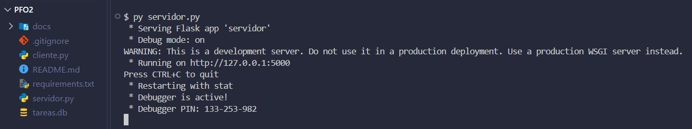
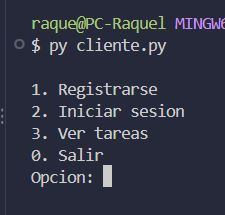
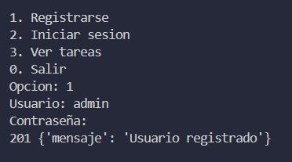
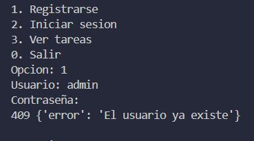
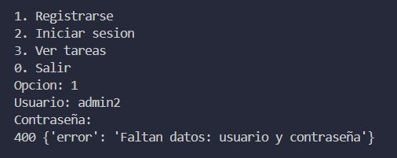
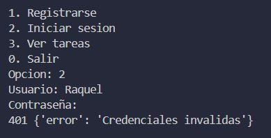
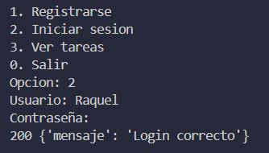
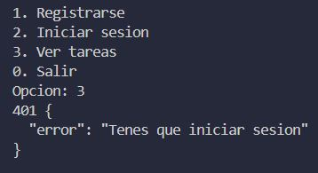
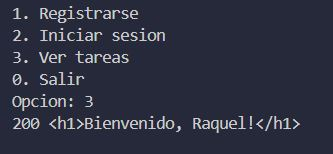
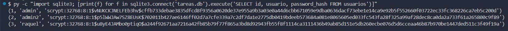

# PFO 2 - Sistema de gestión de tareas

API en Flask con registro de usuarios, inicio de sesión y una ruta de bienvenida. Guarda los datos en SQLite y las contraseñas hasheadas. Programación sobre Redes, IFTS 29.

Página con la documentación: https://raquerh.github.io/PsR_PFO2_Gestion_Tareas/

## Archivos

- `servidor.py`: API Flask con SQLite.
- `cliente.py`: cliente de consola con un menú para usar la API.
- `requirements.txt`: dependencias (flask y requests).
- `docs/`: página de GitHub Pages y capturas de las pruebas.

## Requisitos

Python 3 y las dependencias:

```
pip install -r requirements.txt
```

## Cómo ejecutarlo

1. En una terminal: `py servidor.py`. Queda escuchando en `http://127.0.0.1:5000` y crea `tareas.db` la primera vez.
2. En otra terminal: `py cliente.py`.

En Linux o Mac se usa `python3` en lugar de `py`.

## Endpoints

| Método | Ruta | Qué hace |
|---|---|---|
| POST | /registro | Recibe usuario y contraseña y guarda el hash en la base. Responde 201, 400 o 409. |
| POST | /login | Verifica las credenciales e inicia la sesión. Responde 200 o 401. |
| GET | /tareas | Muestra el HTML de bienvenida si hay una sesión iniciada. Responde 200 o 401. |

## Cómo probarlo

Con el servidor corriendo, se usa el menú de `cliente.py`. El orden de pruebas es este, porque el cliente guarda la sesión una vez que se hace login:

1. Ver tareas sin haber iniciado sesión (401).
2. Registrar un usuario (201).
3. Registrar el mismo usuario otra vez (409).
4. Registrar un usuario sin contraseña (400).
5. Iniciar sesión con una contraseña incorrecta (401).
6. Iniciar sesión con la contraseña correcta (200).
7. Ver tareas con la sesión iniciada (200).
8. Revisar la tabla `usuarios` en la base y comprobar que guarda el hash y no la contraseña.

## Capturas

Servidor y cliente corriendo:




Registro de usuarios:





Inicio de sesión:




Ruta /tareas:




Base de datos, con los hashes en lugar de las contraseñas:



## Respuestas conceptuales

### ¿Por qué hashear contraseñas?

Hasheo las contraseñas para no guardar nunca la contraseña real en la base de datos. El hash es una función de un solo sentido: a partir del hash no se puede volver a la contraseña. Si alguien consigue la base, solo ve los hashes, que no sirven para entrar ni dicen qué contraseña eligió cada usuario. Además, la librería le agrega un salt aleatorio a cada contraseña, así que dos usuarios con la misma contraseña terminan con hashes distintos y no sirven las tablas de hashes ya calculados. En el login el servidor no descifra nada: vuelve a calcular el hash de lo que escribió el usuario y lo compara con el que tiene guardado.

### Ventajas de usar SQLite en este proyecto

SQLite viene incluido en Python, así que no hace falta instalar ni configurar un servidor de base de datos. Toda la base es un solo archivo, `tareas.db`, que se crea solo la primera vez que corre el servidor y se puede borrar para empezar de cero. Para un proyecto chico como este, con pocos usuarios, alcanza, y quien quiera probarlo solo tiene que correr el servidor.
